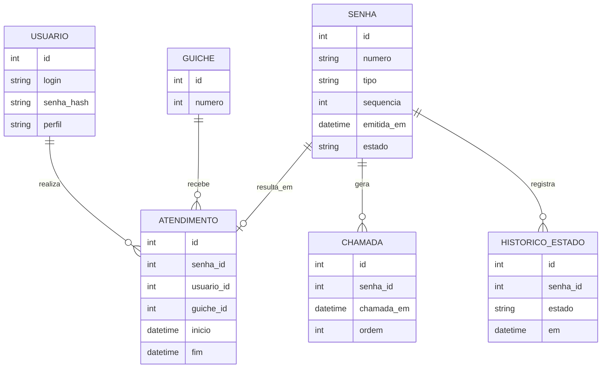

# MER inicial (rascunho)

```mermaid
erDiagram
    USUARIO ||--o{ ATENDIMENTO : realiza
    GUICHE ||--o{ ATENDIMENTO : recebe
    SENHA ||--o{ CHAMADA : gera
    SENHA ||--o| ATENDIMENTO : resulta_em
    SENHA ||--o{ HISTORICO_ESTADO : registra
    USUARIO { int id string login string senha_hash string perfil }
    GUICHE { int id int numero }
    SENHA { int id string numero string tipo int sequencia datetime emitida_em string estado }
    CHAMADA { int id int senha_id datetime chamada_em int ordem }
    ATENDIMENTO { int id int senha_id int usuario_id int guiche_id datetime inicio datetime fim }
    HISTORICO_ESTADO { int id int senha_id string estado datetime em }
```
